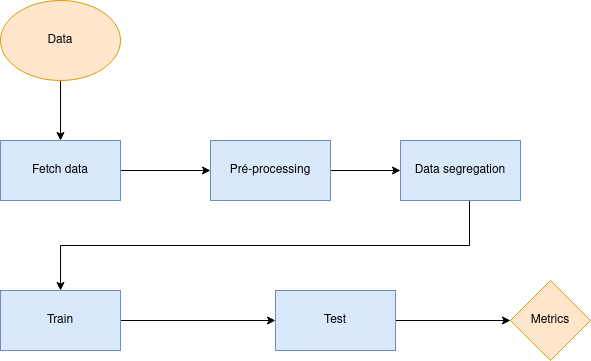
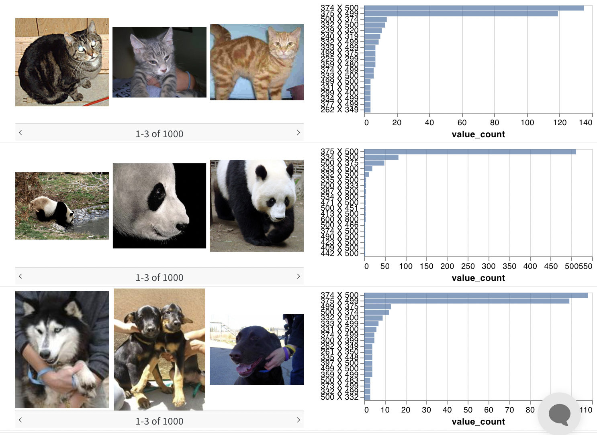

# Model Card
 
Model card é uma explicação sucinta sobre o modelo na forma de um documento, levando a compreender os passos, resultados e ideias geradas durante a etapa de criação.
 
## Model Details
O modelo foi criado por Gildson Bezerra e Micael Balza durante a disciplina de Inteligência Artificial Embarcada na UFRN em 2022.2. O pipeline dos dados foi feito usando ferramentas como Google colab, Scikit-Learn and Weights & Bias e a linguagem python para treinar uma MLP para classificar um problema multiclasse. A big-picture do fluxo de dados e etapas é descrita na imagem a seguir:
 

 
## Intended Use
Este modelo é composto pelas arquivos:  a) ``fecht data``, b) ``pre-processing``, c) ``data_segregation`` d) ``train`` and e) ``test``, que são os nomes dos arquivos encontrados neste gitHub respectivamente para as etapas de coleta do dataset; limpeza e validação; separação dos dados de treinamento;validação e teste; etapa de treinamento e por fim a etapa de teste.
 
## Training Data
 
A proposta é usar uma rede de MLP para classificar as imagens de um dataset com 3000 imagens contendo animais como cachorro, gato e panda. De forma a melhorar a acurácia comparando a solução criada com outra solução implementada usando KNN para o mesmo problema.
 
Foi necessário uma etapa de pré-processamento nas imagens pois o dataset continham dados de diferentes resoluções, todas foram convertidas para a mesma resolução(32x32).
 
 
 

(Imagem retirada de <https://github.com/ivanovitchm/embedded.ai/tree/main/lessons/week_05/first_classifier> em 16/10/2022)
 
## Evaluation Data
Durante a etapa de data_segregation o dataset a pré-processado foi dividido parte para treinamento, e parte para teste na proporção de 70% e 30% respectivamente. Realizou-se também a transformação dos rótulos categóricos em numéricos.
 
 
## Metrics
Foram usadas métricas de performance comuns em técnicas de ML, algumas delas são vistas a seguir e foram usadas como comparativo entre ambas soluções:
 
[accuracy](https://scikit-learn.org/stable/modules/generated/sklearn.metrics.accuracy_score.html), [f1](https://scikit-learn.org/stable/modules/generated/sklearn.metrics.f1_score.html#sklearn.metrics.f1_score), [precision](https://scikit-learn.org/stable/modules/generated/sklearn.metrics.precision_score.html#sklearn.metrics.precision_score), [recall](https://scikit-learn.org/stable/modules/generated/sklearn.metrics.recall_score.html#sklearn.metrics.recall_score).
 
Solução usando KNN
 
**Stage [Run]**                        | **Accuracy** | **F1** | **Precision** | **Recall** |
---------------------------------|--------------|--------|---------------|------------|
Train [likely-snow-4](https://wandb.ai/ivanovitch-silva/first_image_classifier/runs/2ebl5jzc?workspace=user-ivanovitch-silva) | ?      | ? | ?        | ?     | 
Test [confused-sun-5](https://wandb.ai/ivanovitch-silva/first_image_classifier/runs/e8bwl5wq?workspace=user-ivanovitch-silva)  | 0.4533      | 0.4548 | 0.5435        | 0.4533     |
 
Solução usando MLP
 
**Stage [Run]**                        | **Accuracy** | **F1** | **Precision** | **Recall** |
---------------------------------|--------------|--------|---------------|------------|
Train [likely-snow-4](https://wandb.ai/ivanovitch-silva/first_image_classifier/runs/2ebl5jzc?workspace=user-ivanovitch-silva) | ?      | ? | ?        | ?     | 
Test [confused-sun-5](https://wandb.ai/ivanovitch-silva/first_image_classifier/runs/e8bwl5wq?workspace=user-ivanovitch-silva)  | 0.XXXX      | 0.xxxx | 0.xxxx        | 0.Xxxx     |
 
## Ethical Considerations
 
O dataset é composto por 3000 imagens de diferentes animais como cachorros, gatos e pandas. Desta forma os atributos fornecidos ao modelo são para classificar este tipo de dado, e sem garantia de funcionar corretamente em imagens de variados tamanhos diferentes do utilizado no treinamento.
 
## Caveats and Recommendations
FALAR DA DIFERENÇA -- se um foi melhor que o outro -- pq foi assim -- e mostrar a  imagem legal lá e a acurácia
